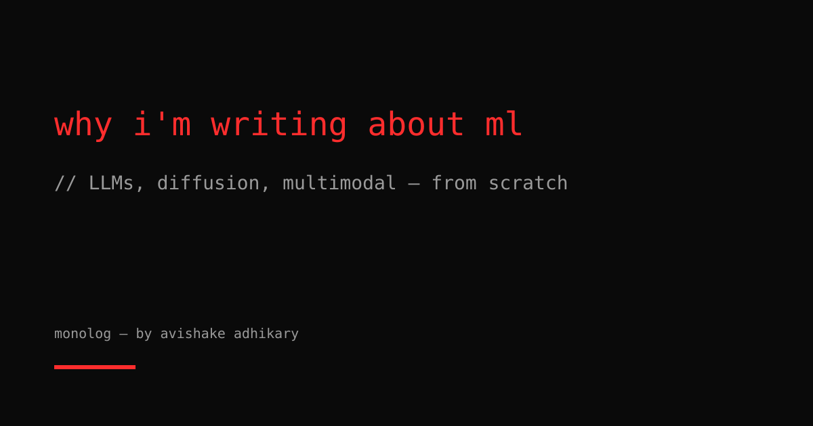

I've wanted a research notebook for a while. The kind where I work through something properly — not tweet-thread depth, not tutorial depth, but actual derivation depth. The kind that would have saved me weeks if I had found it earlier.

So here it is.

## What I build

I'm a machine learning engineer. My work sits at the intersection of research and implementation: I design model architectures, run pretraining experiments, write custom training loops, debug loss divergences at 3am, and occasionally write CUDA kernels when PyTorch doesn't do what I need.

The models I spend the most time on:

- **Large language models.** Transformer variants, attention mechanisms, tokenization, RLHF, KV-cache optimization, quantization. I've trained LLMs from scratch — not fine-tuned, not LoRA-adapted, actually pretrained on raw text.
- **Diffusion models.** Score matching, DDPM/DDIM, latent diffusion, classifier-free guidance, flow matching. The geometry of these models is genuinely beautiful and almost never explained well.
- **Multimodal systems.** Vision-language models, contrastive alignment (CLIP-style), cross-attention between modalities, visual instruction tuning.

## Why I write

Papers are a compression format optimized for peer reviewers, not practitioners. They assume a shared vocabulary that took years to build, skip the "obvious" steps that took me days to figure out, and bury the actual engineering decisions in appendices.

I write to decompress that. When I spend a week understanding why a particular training instability happens, that understanding should exist somewhere other than in my head. When I reimplement a paper and find the three things the paper got wrong, that diff matters.

My writing rule: if I could have used this six months ago, it's worth publishing.

## What to expect

Posts here will be in one of a few shapes:

**Derivations.** Starting from first principles and ending at an equation or implementation. Math will be present and explained.

```python
# The kind of code that belongs in a derivation:
import torch
import torch.nn.functional as F

def scaled_dot_product_attention(q, k, v, mask=None):
    """Attention(Q, K, V) = softmax(QK^T / sqrt(d_k)) V"""
    d_k = q.size(-1)
    scores = torch.matmul(q, k.transpose(-2, -1)) / d_k**0.5
    if mask is not None:
        scores = scores.masked_fill(mask == 0, float('-inf'))
    return torch.matmul(F.softmax(scores, dim=-1), v)
```

**Training notes.** What actually happened when I ran the experiment, including the parts that didn't work. Negative results are underrated.

**Architecture deep-dives.** Reading a model's source code the way you'd read a well-written program — with commentary on the decisions.

If you want to follow along, there's an [RSS feed](/feed.xml). If you want to argue with a take, the [GitHub repo](https://github.com/avishakeadhikary) is the right place.
