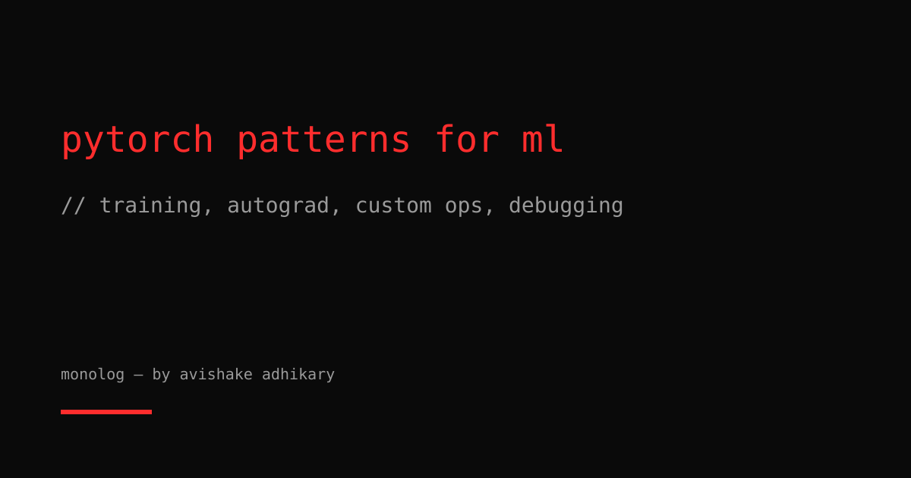

Most PyTorch tutorials show you how to train a two-layer MLP on MNIST. Real ML engineering looks different. Here are five patterns I reach for constantly when training models that actually matter.

## 1. Custom autograd functions for non-differentiable operations

When you need an operation in the forward pass that PyTorch can't differentiate automatically — a custom CUDA kernel, a straight-through estimator, a discrete sampling step — write a `torch.autograd.Function`.

```python
import torch
from torch.autograd import Function

class StraightThroughEstimator(Function):
    """Forward: quantize. Backward: pass gradient through unchanged."""

    @staticmethod
    def forward(ctx, x: torch.Tensor, n_levels: int = 256) -> torch.Tensor:
        scale = n_levels - 1
        return (x * scale).round() / scale

    @staticmethod
    def backward(ctx, grad_output: torch.Tensor):
        # Gradient flows as if quantization didn't happen
        return grad_output, None  # None for n_levels (non-tensor arg)

quantize = StraightThroughEstimator.apply
x = torch.rand(4, 16, requires_grad=True)
y = quantize(x)
y.sum().backward()  # Works — gradient flows through
```

The key insight: `backward` receives the gradient *with respect to the output* and must return the gradient *with respect to each input*. Return `None` for non-tensor inputs.

## 2. Gradient checkpointing for memory-constrained training

Attention layers in LLMs store O(n²) activations during the forward pass for backprop. At sequence length 8192 and batch size 16, this is prohibitive. `torch.utils.checkpoint.checkpoint` recomputes activations during backward instead of storing them.

```python
import torch
from torch.utils.checkpoint import checkpoint

class CheckpointedTransformerBlock(torch.nn.Module):
    def __init__(self, d_model: int, n_heads: int):
        super().__init__()
        self.attn = torch.nn.MultiheadAttention(d_model, n_heads, batch_first=True)
        self.norm1 = torch.nn.LayerNorm(d_model)
        self.ff = torch.nn.Sequential(
            torch.nn.Linear(d_model, 4 * d_model),
            torch.nn.GELU(),
            torch.nn.Linear(4 * d_model, d_model),
        )
        self.norm2 = torch.nn.LayerNorm(d_model)

    def _forward(self, x: torch.Tensor) -> torch.Tensor:
        attn_out, _ = self.attn(x, x, x, need_weights=False)
        x = self.norm1(x + attn_out)
        return self.norm2(x + self.ff(x))

    def forward(self, x: torch.Tensor) -> torch.Tensor:
        return checkpoint(self._forward, x, use_reentrant=False)
```

Trade-off: roughly 30% more compute per step, but peak memory drops by ~70% for deep models. Worth it for sequence lengths above 4K.

## 3. Detecting and handling loss NaNs before they propagate

A NaN in the loss silently corrupts all parameters. By the time you notice, the checkpoint is useless. Detect early.

```python
import torch

def safe_backward(loss: torch.Tensor, optimizer: torch.optim.Optimizer, scaler=None) -> bool:
    """Run backward only if loss is finite. Returns True if the step was taken."""
    if not loss.isfinite():
        print(f"[warn] loss is {loss.item():.4f} — skipping step")
        optimizer.zero_grad()
        return False

    if scaler is not None:
        scaler.scale(loss).backward()
        scaler.unscale_(optimizer)
        grad_norm = torch.nn.utils.clip_grad_norm_(
            [p for group in optimizer.param_groups for p in group['params']], max_norm=1.0
        )
        if not grad_norm.isfinite():
            optimizer.zero_grad()
            scaler.update()
            return False
        scaler.step(optimizer)
        scaler.update()
    else:
        loss.backward()
        torch.nn.utils.clip_grad_norm_(
            [p for group in optimizer.param_groups for p in group['params']], max_norm=1.0
        )
        optimizer.step()

    optimizer.zero_grad()
    return True
```

The most common NaN sources: `log(0)` (add epsilon), softmax overflow (use `F.log_softmax` + NLLLoss), and QK scores blowing up (scale by `1/sqrt(d_k)`, always).

## 4. `torch.compile` for real training speedups

`torch.compile` converts your model into optimized Triton kernels. On A100/H100 it typically gives 20–40% throughput improvement for transformer training with zero code changes.

```python
import torch

model = MyTransformer(d_model=512, n_layers=12, n_heads=8).cuda()

# mode='reduce-overhead' suits training loops.
# fullgraph=True forces a single graph — errors on dynamic control flow.
compiled_model = torch.compile(model, mode='reduce-overhead', fullgraph=False)

x = torch.randint(0, 32000, (8, 512)).cuda()
logits = compiled_model(x)  # First call: ~60s compile. Subsequent: fast.
```

Caveats: the first step takes 30–120s to compile; dynamic shapes inhibit graph reuse (bucket sequence lengths into fixed bins); Python-level branching on tensor values is not supported.

## 5. Writing clean training loops with `contextlib`

Long training loops accumulate state in ways that cause subtle bugs. Encapsulate setup/teardown in context managers.

```python
import torch
from contextlib import contextmanager
from typing import Generator

@contextmanager
def eval_mode(model: torch.nn.Module) -> Generator:
    """Temporarily switch to eval and restore training state."""
    was_training = model.training
    model.eval()
    try:
        with torch.no_grad():
            yield model
    finally:
        model.train(was_training)

@contextmanager
def autocast_if_available(dtype: torch.dtype = torch.bfloat16) -> Generator:
    if torch.cuda.is_available() and torch.cuda.is_bf16_supported():
        with torch.autocast('cuda', dtype=dtype):
            yield
    else:
        yield

# Usage in training loop
for step, (x, y) in enumerate(train_loader):
    with autocast_if_available():
        loss = model(x, y)
    safe_backward(loss, optimizer, scaler)

    if step % 100 == 0:
        with eval_mode(model) as m:
            val_loss = compute_val_loss(m, val_loader)
        print(f"step {step}: train={loss:.4f}, val={val_loss:.4f}")
```

## The pattern underneath all of these

Every pattern above solves the same meta-problem: **isolating side effects**. Autograd functions isolate gradient flow. Checkpointing isolates memory. NaN detection isolates corrupted state. Compile isolates optimization. Contexts isolate mode switches.

ML engineering is mostly about controlling state in a system that has a lot of invisible state. The more explicit and isolated you make it, the fewer 3am debugging sessions you'll have.
