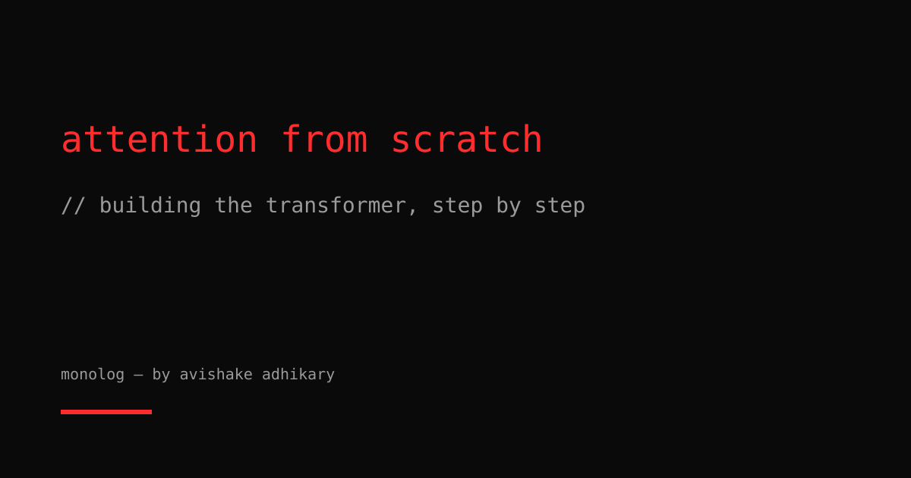
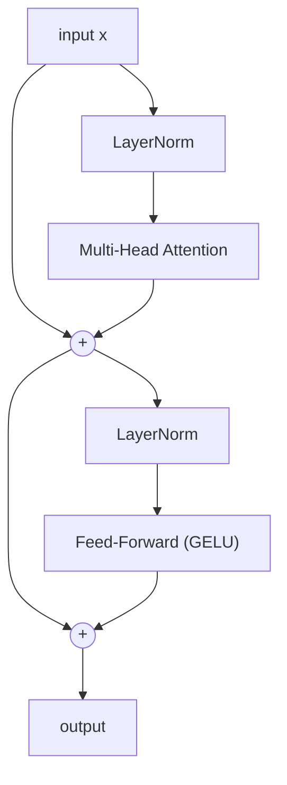

The transformer is still the dominant architecture in ML, years after "Attention Is All You Need." But most explanations start with the high-level diagram and work down, treating the attention equation as a given. I want to go the other direction: start from the problem, derive the solution, implement it.

## The problem attention solves

In a sequence model, each token needs to incorporate information from other tokens. The naive approach — a fixed-size hidden state (RNN) — creates an information bottleneck: all context must be compressed into a single vector before being used.

Attention removes this bottleneck by allowing each token to **directly query all other tokens** and retrieve a weighted combination of their values. The query tells you what you're looking for; the keys tell you what's available; the values are what you get.

## Scaled dot-product attention

Formally, given queries $Q \in \mathbb{R}^{n \times d_k}$, keys $K \in \mathbb{R}^{m \times d_k}$, and values $V \in \mathbb{R}^{m \times d_v}$:

$$
\text{Attention}(Q, K, V) = \text{softmax}\left(\frac{QK^T}{\sqrt{d_k}}\right) V
$$

The $\sqrt{d_k}$ scaling factor is critical. Without it, large $d_k$ causes dot products to grow large, pushing softmax into saturation regions where gradients vanish.

```python
import torch
import torch.nn.functional as F
from typing import Optional

def scaled_dot_product_attention(
    q: torch.Tensor,        # (B, H, N, d_k)
    k: torch.Tensor,        # (B, H, M, d_k)
    v: torch.Tensor,        # (B, H, M, d_v)
    mask: Optional[torch.Tensor] = None,
    dropout_p: float = 0.0,
) -> torch.Tensor:
    d_k = q.size(-1)
    scores = torch.matmul(q, k.transpose(-2, -1)) / d_k**0.5
    if mask is not None:
        scores = scores.masked_fill(mask == 0, float('-inf'))
    weights = F.softmax(scores, dim=-1)
    if dropout_p > 0.0:
        weights = F.dropout(weights, p=dropout_p)
    return torch.matmul(weights, v)  # (B, H, N, d_v)
```

Note: PyTorch 2.0+ has `F.scaled_dot_product_attention` which dispatches to FlashAttention when available. Use it in production — I'm implementing from scratch for clarity.

## Multi-head attention

A single attention head can only attend with one "query strategy" at a time. Multi-head attention runs $H$ heads in parallel, each with different learned projections. This lets heads specialize: some attend to syntax, some to semantics, some to position.

$$
\text{MultiHead}(Q, K, V) = \text{Concat}(\text{head}_1, \ldots, \text{head}_H) W^O
$$

```python
import torch.nn as nn

class MultiHeadAttention(nn.Module):
    def __init__(self, d_model: int, n_heads: int, dropout: float = 0.1):
        super().__init__()
        assert d_model % n_heads == 0
        self.d_model = d_model
        self.n_heads = n_heads
        self.d_k = d_model // n_heads
        self.W_q = nn.Linear(d_model, d_model, bias=False)
        self.W_k = nn.Linear(d_model, d_model, bias=False)
        self.W_v = nn.Linear(d_model, d_model, bias=False)
        self.W_o = nn.Linear(d_model, d_model, bias=False)
        self.dropout = dropout

    def split_heads(self, x: torch.Tensor) -> torch.Tensor:
        B, N, _ = x.shape
        return x.view(B, N, self.n_heads, self.d_k).transpose(1, 2)

    def merge_heads(self, x: torch.Tensor) -> torch.Tensor:
        B, H, N, d_k = x.shape
        return x.transpose(1, 2).contiguous().view(B, N, H * d_k)

    def forward(self, x: torch.Tensor, context: Optional[torch.Tensor] = None,
                mask: Optional[torch.Tensor] = None) -> torch.Tensor:
        if context is None:
            context = x
        q = self.split_heads(self.W_q(x))
        k = self.split_heads(self.W_k(context))
        v = self.split_heads(self.W_v(context))
        dp = self.dropout if self.training else 0.0
        attended = scaled_dot_product_attention(q, k, v, mask, dp)
        return self.W_o(self.merge_heads(attended))
```

## Positional encoding

Attention is permutation-equivariant — it doesn't care about token order. We inject position explicitly via sinusoidal encoding:

$$
PE_{(pos, 2i)} = \sin\left(\frac{pos}{10000^{2i/d_{model}}}\right), \quad
PE_{(pos, 2i+1)} = \cos\left(\frac{pos}{10000^{2i/d_{model}}}\right)
$$

```python
import math

class SinusoidalPositionalEncoding(nn.Module):
    def __init__(self, d_model: int, max_seq_len: int = 4096, dropout: float = 0.1):
        super().__init__()
        self.dropout = nn.Dropout(dropout)
        pe = torch.zeros(max_seq_len, d_model)
        position = torch.arange(max_seq_len, dtype=torch.float).unsqueeze(1)
        div_term = torch.exp(
            torch.arange(0, d_model, 2, dtype=torch.float) * (-math.log(10000.0) / d_model)
        )
        pe[:, 0::2] = torch.sin(position * div_term)
        pe[:, 1::2] = torch.cos(position * div_term)
        self.register_buffer('pe', pe.unsqueeze(0))  # (1, L, d_model)

    def forward(self, x: torch.Tensor) -> torch.Tensor:
        return self.dropout(x + self.pe[:, :x.size(1)])
```

Modern LLMs typically use **Rotary Position Embedding (RoPE)** instead, which encodes relative positions directly into the QK dot product — that deserves its own post.

## The encoder block

An encoder block: multi-head self-attention → residual + norm → feed-forward → residual + norm.



```python
class TransformerEncoderBlock(nn.Module):
    def __init__(self, d_model: int, n_heads: int, d_ff: int, dropout: float = 0.1):
        super().__init__()
        self.attn = MultiHeadAttention(d_model, n_heads, dropout)
        self.ff = nn.Sequential(
            nn.Linear(d_model, d_ff),
            nn.GELU(),
            nn.Dropout(dropout),
            nn.Linear(d_ff, d_model),
        )
        self.norm1 = nn.LayerNorm(d_model)
        self.norm2 = nn.LayerNorm(d_model)
        self.drop1 = nn.Dropout(dropout)
        self.drop2 = nn.Dropout(dropout)

    def forward(self, x: torch.Tensor, mask: Optional[torch.Tensor] = None) -> torch.Tensor:
        # Pre-norm variant (as in GPT-2/3) — more stable than post-norm
        x = x + self.drop1(self.attn(self.norm1(x), mask=mask))
        x = x + self.drop2(self.ff(self.norm2(x)))
        return x
```

## Putting it together

```python
class TransformerEncoder(nn.Module):
    def __init__(self, vocab_size: int, d_model: int = 512, n_heads: int = 8,
                 n_layers: int = 6, d_ff: int = 2048, max_seq_len: int = 512,
                 dropout: float = 0.1):
        super().__init__()
        self.embedding = nn.Embedding(vocab_size, d_model)
        self.pos_enc = SinusoidalPositionalEncoding(d_model, max_seq_len, dropout)
        self.layers = nn.ModuleList([
            TransformerEncoderBlock(d_model, n_heads, d_ff, dropout)
            for _ in range(n_layers)
        ])
        self.norm = nn.LayerNorm(d_model)
        self._init_weights()

    def _init_weights(self):
        nn.init.normal_(self.embedding.weight, mean=0, std=self.embedding.embedding_dim**-0.5)
        for m in self.modules():
            if isinstance(m, nn.Linear):
                nn.init.xavier_uniform_(m.weight)
                if m.bias is not None:
                    nn.init.zeros_(m.bias)

    def forward(self, tokens: torch.Tensor, mask: Optional[torch.Tensor] = None) -> torch.Tensor:
        x = self.pos_enc(self.embedding(tokens) * self.embedding.embedding_dim**0.5)
        for layer in self.layers:
            x = layer(x, mask)
        return self.norm(x)

# Sanity check
model = TransformerEncoder(vocab_size=32000, d_model=256, n_heads=4, n_layers=4)
tokens = torch.randint(0, 32000, (2, 64))
out = model(tokens)
print(out.shape)  # torch.Size([2, 64, 256])
```

## What this doesn't cover

The above is the encoder half. A full seq2seq transformer adds a decoder with causal masking (each position only attends to previous positions) and cross-attention (queries from decoder, keys/values from encoder output). A language model is just the encoder stack with causal masking — no decoder needed.

The pieces worth a dedicated post: RoPE, FlashAttention (IO-aware exact attention), GQA (grouped query attention for faster inference), and KV-cache management for autoregressive generation.

The transformer is simple enough to implement in an afternoon and deep enough to spend years understanding. Start with the implementation. The intuition follows.
